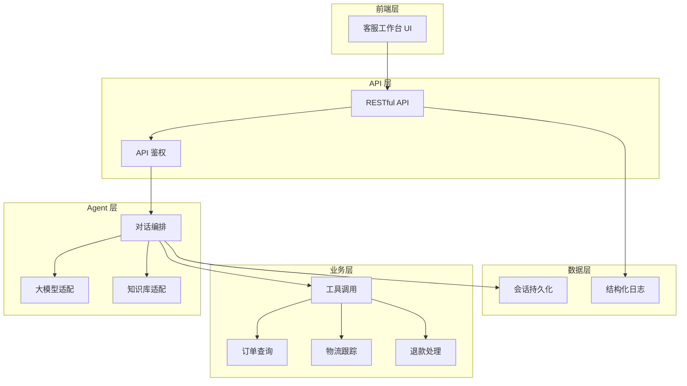

# Customer Service Agent

一个生产级的智能客服工作台，为电商客服场景设计。本项目以车载用品店铺为业务示例，演示如何将对话智能、知识检索、业务工具和质检复盘整合到统一的客服接待系统中。

## 特性

- **生产就绪**：完整的会话持久化、结构化日志、API 鉴权和异常处理
- **模型无关**：支持 DeepSeek、智谱、火山引擎等主流大模型，统一的工具调用接口
- **知识可维护**：Dify Dataset 托管商品知识和 FAQ，支持运营团队独立更新
- **业务可扩展**：订单、物流、退款工具层抽象，可快速接入真实业务系统
- **前端专业**：去模板化设计，符合 SaaS 工作台视觉规范，移动端优先响应式布局

## 预览

### 桌面端工作台


### 移动端适配


## 架构设计

本项目采用分层架构，将客服业务逻辑与底层能力解耦：



### 核心设计理念

**1. 模型无关的工具调用层**

不同大模型的工具调用格式不同，本项目通过统一的工具定义层抽象了这些差异。无论使用 DeepSeek 的 function calling、智谱的 tools，还是火山引擎的 bot tools，业务工具代码无需修改。

**2. 知识与业务数据分离**

稳定的商品介绍、售后规则等知识放在 Dify Dataset 中，由运营团队维护；实时的订单状态、物流节点等业务数据通过 HTTP 接口实时查询，保证数据时效性。

**3. 会话持久化与复盘能力**

所有接待会话保存在 SQLite 中，支持历史会话查询、对话总结生成和 FAQ 沉淀。质检模块可以对历史会话进行批量审计。

**4. 可观测性优先**

结构化日志记录每次请求的完整链路：大模型调用耗时、知识库检索召回、工具执行结果、业务接口响应。便于定位性能瓶颈和业务问题。

## 核心功能

| 功能模块 | 说明 | 适用场景 |
| --- | --- | --- |
| 智能对话 | 流式/非流式回复，支持多轮上下文 | 商品咨询、售后解答 |
| 知识检索 | Dify Dataset 语义检索，支持多知识库 | 商品介绍、FAQ 问答 |
| 工具调用 | 订单查询、物流跟踪、退款处理 | 订单状态查询、售后处理 |
| 会话管理 | SQLite 持久化，支持会话查询和继续 | 客服交接、历史复盘 |
| 质检审计 | 本地规则质检 + 大模型质检 | 服务质量监控 |
| 对话总结 | 自动生成接待摘要 | 工单归档、交接记录 |
| FAQ 沉淀 | 高质量问答保存为知识 | 知识库迭代优化 |

## 技术栈

### 后端

- **框架**：FastAPI（异步高性能）、Arkitect BotServer（对话编排）
- **语言**：Python 3.10+
- **数据库**：SQLite（会话持久化）
- **日志**：JSON Lines 结构化日志

### 前端

- **技术**：原生 HTML / CSS / JavaScript
- **特点**：无框架依赖、轻量级、SEO 友好
- **设计**：去模板化、SaaS 工作台风格、移动端优先

### 大模型

| 模型 | 支持状态 | 工具调用 | 推荐场景 |
| --- | --- | --- | --- |
| DeepSeek V3/V4 | ✅ | ✅ | 生产推荐，性价比高 |
| 智谱 GLM-4/5 | ✅ | ✅ | 中文理解强 |
| 火山引擎 Doubao | ✅ | ✅ | 原始接口兼容 |
| OpenAI Compatible | ✅ | ✅ | 自建模型 |

### 知识库

| 方案 | 支持状态 | 推荐度 | 说明 |
| --- | --- | --- | --- |
| Dify Dataset | ✅ | ⭐⭐⭐ | 易于维护，支持多数据集 |
| 火山引擎知识库 | ✅ | ⭐⭐ | 原始接口兼容 |

## 快速启动

### 环境要求

- Python 3.10 或 3.11
- Node.js 16+（用于前端语法检查）
- Git

### 1. 克隆项目

```bash
git clone https://github.com/qiqiqi-max/customer-service-agent.git
cd customer-service-agent/backend
```

### 2. 安装依赖

```bash
python -m venv .venv
.\.venv\Scripts\Activate.ps1  # Windows
# source .venv/bin/activate    # Linux/Mac

pip install uv
uv sync
```

### 3. 配置环境变量

复制配置模板：

```bash
cp .env.local.example .env.local
```

**本地演示配置**（使用 Mock 数据）：

```env
MOCK_MODE=True
LANGUAGE=zh
BUSINESS_DATA_PROVIDER=mock
API_KEYS=
```

**生产配置示例**：

```env
# 模型配置
MOCK_MODE=False
LLM_PROVIDER=deepseek
DEEPSEEK_API_KEY=sk-xxx
DEEPSEEK_MODEL=deepseek-chat

# 知识库配置
KNOWLEDGE_PROVIDER=dify
DIFY_API_KEY=dataset-xxx
DIFY_DATASET_ID=xxx-product
DIFY_FAQ_DATASET_ID=xxx-faq

# 业务系统配置
BUSINESS_DATA_PROVIDER=http
BUSINESS_API_BASE_URL=https://api.example.com
BUSINESS_API_KEY=xxx
```

### 4. 启动服务

```bash
.\start_demo.ps1
```

默认访问地址：`http://127.0.0.1:8080/demo`

检查服务健康状态：

```bash
curl http://127.0.0.1:8080/ready
```

## 生产部署建议

### 大模型选择

**DeepSeek V3/V4 Pro**（推荐）

- 性价比最高，工具调用稳定
- 中文理解能力强
- 支持流式输出

```env
LLM_PROVIDER=deepseek
DEEPSEEK_API_KEY=sk-xxx
DEEPSEEK_MODEL=deepseek-chat
```

**智谱 GLM-5**

- 中文场景表现优秀
- 工具调用准确率高

```env
LLM_PROVIDER=zhipu
ZHIPU_API_KEY=xxx
ZHIPU_MODEL=glm-4-plus
```

### 知识库配置

推荐在 Dify 中创建两个独立的 Dataset：

1. **商品知识库**：商品介绍、规格、适配、使用说明
2. **FAQ 知识库**：售后政策、常见问题、客服话术

本项目提供了开箱即用的知识文件：

- `docs/dify_product_service_knowledge.md`
- `docs/dify_faq_knowledge.md`

直接导入 Dify 即可使用。

### 业务系统接入

本地演示使用 Mock 数据，生产环境需要接入真实业务系统：

```env
BUSINESS_DATA_PROVIDER=http
BUSINESS_API_BASE_URL=https://your-api.example.com
BUSINESS_API_KEY=xxx
BUSINESS_API_TIMEOUT=8
```

业务系统需要实现以下接口：

- `GET /orders?account_id={id}` - 查询用户订单列表
- `GET /orders/{order_id}?account_id={id}` - 查询订单详情
- `GET /tracking?order_id={id}&tracking_number={num}` - 查询物流
- `POST /refunds` - 提交退款申请

详见 [API.md](API.md)。

## 测试

### 单元测试

```bash
.\.venv\Scripts\python.exe -m unittest discover -s tests -v
```

### 前端语法检查

```bash
node --check .\webui\app.js
```

### 代码语法检查

```bash
.\.venv\Scripts\python.exe -m compileall -q main.py config.py
```

## 扩展开发

### 添加新的业务工具

1. 在 `tools/` 目录下创建新的工具模块
2. 在 `agent_tools.py` 中注册工具定义
3. 在 `business_services.py` 中实现业务逻辑

### 接入新的大模型

1. 在 `llm_provider.py` 中添加新的 Provider 类
2. 实现 `chat_completion()` 和 `chat_completion_stream()` 方法
3. 在 `.env.local` 中配置新模型参数

### 自定义质检规则

编辑 `quality_rules.py`，添加新的质检规则函数。

## 目录结构

```text
backend/
├── main.py                    # 服务入口
├── config.py                  # 配置管理
├── llm_provider.py            # 大模型适配层
├── business_services.py       # 业务数据层
├── conversation_store.py      # 会话持久化
├── agent_tools.py             # 工具调用定义
├── mock_agent.py              # Mock 模式实现
├── quality_rules.py           # 质检规则
├── observability.py           # 可观测性
├── data/                      # 数据模块
│   ├── product.py             # 商品数据
│   ├── orders.py              # 订单 Mock
│   ├── tracking.py            # 物流 Mock
│   └── rag.py                 # 知识库检索
├── tools/                     # 业务工具
│   ├── order_check.py         # 订单查询
│   ├── pack_track.py          # 物流查询
│   └── order_refund.py        # 退款处理
├── webui/                     # 前端
│   ├── index.html
│   ├── styles.css
│   └── app.js
├── docs/                      # 文档和资源
│   ├── images/
│   ├── dify_product_service_knowledge.md
│   ├── dify_faq_knowledge.md
│   └── knowledge_source/      # 商品与 FAQ 原始素材（docx / xlsx）
└── tests/                     # 测试
```

## 常见问题

### 如何切换大模型？

修改 `.env.local` 中的 `LLM_PROVIDER` 和对应的 API Key。

### 如何添加新的商品知识？

在 Dify Dataset 中直接添加文档，无需重启服务。

### 如何查看历史会话？

访问 `GET /api/conversations` 获取会话列表，或通过前端工作台查看。

### Mock 模式和真实模式有什么区别？

Mock 模式使用本地数据，适合开发调试；真实模式调用大模型和业务接口，适合生产环境。

## 路线图

- [ ] 支持多租户隔离
- [ ] 增加 Redis 缓存层
- [ ] 支持多客服协同
- [ ] 增加人工接管能力
- [ ] 支持富文本消息
- [ ] Docker 容器化部署
- [ ] Kubernetes 编排示例
- [ ] 性能监控和告警

## 贡献指南

欢迎提交 Issue 和 Pull Request！

提交代码前请确保：

1. 通过所有单元测试
2. 代码符合 PEP 8 规范
3. 补充必要的测试用例
4. 更新相关文档

## 许可证

MIT License

## 联系方式

如有问题或建议，欢迎通过 GitHub Issues 联系。

如果这个项目对你有帮助，请给个 ⭐ Star！
