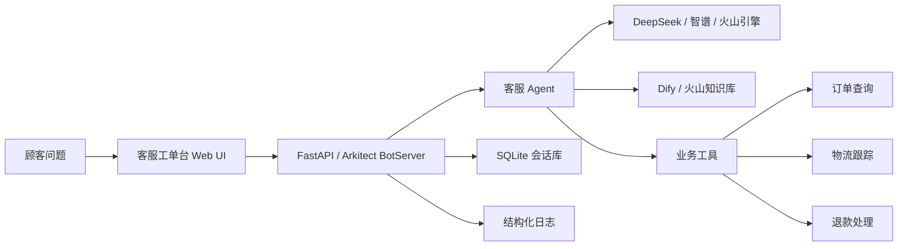

# Customer Service Agent

一个面向电商客服场景的智能坐席工作台。项目以车载用品店铺为示例，把客服对话、商品知识库、订单查询、物流跟踪、退款处理、质检、会话总结和 FAQ 沉淀放在同一个工作台里。

它不是一个单纯的聊天框 Demo，而是一个可以继续接入真实业务系统的客服 Agent 原型：本地可以用 Mock 数据直接跑起来，模型可以切换到 DeepSeek、智谱或火山引擎，知识库可以接 Dify，订单/物流/退款可以替换成你自己的 HTTP 业务接口。

## 预览

### 桌面端工作台


### 移动端适配


## 这个项目解决什么问题

电商客服不是只回答一句话。一次真实接待里，客服通常要同时看商品资料、订单状态、物流节点、售后规则，还要保留处理记录，后续做质检和复盘。

这个项目把这些动作拆成几层：

- 前端是一个客服工单台，不是普通聊天页。
- 大模型负责理解用户问题、生成回复、决定是否调用工具。
- 知识库负责提供商品介绍、售后规则和 FAQ。
- 工具层负责订单查询、物流查询、退款处理。
- 会话层负责保存历史接待，方便继续服务和复盘。

## 核心功能

| 功能 | 说明 |
| --- | --- |
| 客服工作台 | 左侧配置接待场景、商品范围和服务权限，中间处理对话，右侧查看结果、轨迹和沉淀 |
| 智能回复 | 支持流式和非流式回复，可根据问题生成客服话术 |
| 知识库问答 | 支持火山引擎知识库，也支持 Dify Dataset |
| 工具调用 | 支持订单查询、物流跟踪、退款退货，DeepSeek/智谱等 OpenAI 兼容模型也能走工具调用 |
| 会话持久化 | 使用 SQLite 保存会话、账号、消息和元数据 |
| 质检 | 内置本地规则质检，也保留大模型质检接口 |
| 对话总结 | 将当前接待整理成摘要，方便交接和复盘 |
| FAQ 沉淀 | 将高质量问答保存为可复用知识 |
| API 鉴权 | 标准 `/api/*` 接口支持可选 API Key |
| 结构化日志 | 记录请求、大模型调用、知识库检索、工具执行和业务接口耗时 |

## 技术栈

- 后端：Python、FastAPI、Arkitect BotServer
- 前端：原生 HTML / CSS / JavaScript
- 模型：火山引擎 Ark、DeepSeek、智谱、其他 OpenAI-compatible Chat Completions API
- 知识库：火山引擎知识库、Dify Dataset API
- 数据：SQLite、本地 Mock 数据、JSON Lines 日志
- 测试：Python unittest、前端 JS 语法检查、Playwright 截图验收

## 架构



## 目录结构

```text
.
├── main.py                    # 服务入口，注册页面、标准 API 和兼容 API
├── config.py                  # 环境变量配置
├── llm_provider.py            # DeepSeek / 智谱 / OpenAI-compatible 模型适配
├── business_services.py       # 订单、物流、退款的 Mock / HTTP 业务数据层
├── conversation_store.py      # SQLite 会话持久化
├── agent_tools.py             # 工具调用定义和结果转换
├── mock_agent.py              # 本地 Mock 回复能力
├── quality_rules.py           # 本地质检规则
├── observability.py           # JSON 结构化日志
├── data/
│   ├── product.py             # 商品基础数据
│   ├── orders.py              # Mock 订单数据
│   ├── tracking.py            # Mock 物流数据
│   └── rag.py                 # 火山引擎 / Dify 知识库检索与 FAQ 保存
├── tools/
│   ├── order_check.py         # 订单查询工具
│   ├── pack_track.py          # 物流查询工具
│   └── order_refund.py        # 退款处理工具
├── webui/
│   ├── index.html             # 客服工作台页面
│   ├── styles.css             # 工作台样式
│   └── app.js                 # 前端交互和接口调用
├── docs/
│   ├── images/                # README 展示图片
│   ├── dify_product_service_knowledge.md
│   └── dify_faq_knowledge.md
├── tests/                     # 单元测试
├── API.md                     # API 和环境变量说明
└── start_demo.ps1             # Windows 本地启动脚本
```

## 快速启动

### 1. 克隆项目

```powershell
git clone https://github.com/qiqiqi-max/customer-service-agent.git
cd customer-service-agent
```

### 2. 安装依赖

要求 Python 3.10 或 3.11。

```powershell
python -m venv .venv
.\.venv\Scripts\Activate.ps1
pip install uv
uv sync
```

### 3. 创建本地配置

```powershell
Copy-Item .env.local.example .env.local
```

本地演示可以先用 Mock 模式，不需要云服务密钥：

```env
MOCK_MODE=True
LANGUAGE=zh
BUSINESS_DATA_PROVIDER=mock
API_KEYS=
```

### 4. 启动

```powershell
.\start_demo.ps1
```

默认打开：

```text
http://127.0.0.1:8080/demo
```

如果 8080 被占用，可以手动指定端口：

```powershell
$env:_FAAS_RUNTIME_PORT='8081'
.\.venv\Scripts\python.exe main.py
```

检查服务：

```powershell
Invoke-RestMethod -Method GET http://127.0.0.1:8080/ready
```

## 模型接入

### Mock 模式

```env
MOCK_MODE=True
```

适合本地演示、前端联调和测试。

### DeepSeek

```env
MOCK_MODE=False
LLM_PROVIDER=deepseek
DEEPSEEK_API_KEY=your_deepseek_api_key
DEEPSEEK_BASE_URL=https://api.deepseek.com
DEEPSEEK_MODEL=deepseekv4pro
```

如果你的 DeepSeek 模型 ID 不同，只改 `DEEPSEEK_MODEL`。

### 智谱

```env
MOCK_MODE=False
LLM_PROVIDER=zhipu
ZHIPU_API_KEY=your_zhipu_api_key
ZHIPU_BASE_URL=https://open.bigmodel.cn/api/paas/v4/
ZHIPU_MODEL=glm-5.2
```

### 火山引擎

```env
MOCK_MODE=False
LLM_PROVIDER=volcengine
VOLC_ACCESSKEY=your_ak
VOLC_SECRETKEY=your_sk
LLM_ENDPOINT_ID=doubao-seed-1-6-250615
ARK_API_KEY=your_ark_api_key
USE_SERVER_AUTH=True
```

## Dify 知识库接入

仓库里已经准备了两份可以直接导入 Dify 的知识文件：

- `docs/dify_product_service_knowledge.md`：商品介绍、卖点、适配场景、安装和售后说明。
- `docs/dify_faq_knowledge.md`：常见问题、客服话术、售后规则和运营沉淀。

推荐在 Dify 中建两个 Dataset：

- 商品知识库：回答商品介绍、规格、适配和使用建议。
- FAQ 知识库：回答售后政策、物流、退款和常见问题。

配置：

```env
MOCK_MODE=False
KNOWLEDGE_PROVIDER=dify
DIFY_API_KEY=your_dify_api_key
DIFY_BASE_URL=https://api.dify.ai/v1
DIFY_DATASET_ID=your_product_dataset_id
DIFY_FAQ_DATASET_ID=your_faq_dataset_id
DIFY_TOP_K=5
DIFY_SCORE_THRESHOLD_ENABLED=False
DIFY_SCORE_THRESHOLD=0
```

稳定知识放在 Dify；实时订单、物流、退款进度不要放进知识库，应通过业务接口读取。

## 接入真实业务系统

本地默认使用 Mock 数据：

```env
BUSINESS_DATA_PROVIDER=mock
```

如果要接入真实订单、物流和售后系统，切换为 HTTP：

```env
BUSINESS_DATA_PROVIDER=http
BUSINESS_API_BASE_URL=https://your-business-api.example.com
BUSINESS_API_KEY=your_business_api_key
BUSINESS_API_TIMEOUT=8
```

业务系统需要提供这些接口：

```http
GET /orders?account_id=100000
GET /orders/{order_id}?account_id=100000
GET /orders?account_id=100000&product=product_name
GET /tracking?account_id=100000&order_id=order_id&tracking_number=tracking_number
POST /refunds
```

`POST /refunds` 请求示例：

```json
{
  "account_id": "100000",
  "order_id": "order_id",
  "reason": "customer refund reason"
}
```

## 常用 API

```http
GET  /health
GET  /ready
GET  /api/products
POST /api/chat
POST /api/faqs
POST /api/quality-check
POST /api/summary
GET  /api/conversations
GET  /api/conversations/{conversation_id}
```

兼容原始 Bot 接口：

```http
POST /api/v3/bots/chat/completions
POST /api/v3/bots/chat/completions/save_faq
POST /api/v3/bots/chat/completions/summary
POST /api/v3/bots/chat/completions/quality_inspection
POST /api/v3/bots/chat/completions/next_question
```

完整接口说明见 [API.md](API.md)。

## 测试

```powershell
node --check .\webui\app.js
.\.venv\Scripts\python.exe -m unittest discover -s tests -v
.\.venv\Scripts\python.exe -m compileall -q main.py config.py agent_tools.py business_services.py conversation_store.py llm_provider.py mock_agent.py observability.py quality_rules.py data tools
```

## 可继续优化的方向

- 接入真实订单、物流和售后系统，替换本地 Mock 数据。
- 在 Dify 中维护商品知识库和 FAQ 知识库，形成运营更新流程。
- 增加人工接管、满意度评价、工单标签、用户画像和风险升级。
- 增加租户隔离、接口限流、权限控制和更完整的审计日志。
- 将前端拆成组件化工程，扩展成更完整的客服运营后台。

## 说明

这个项目保留了原始示例中的部分火山引擎兼容接口，同时增加了 DeepSeek、智谱、Dify、业务 HTTP 适配、会话持久化和新的客服工作台页面。你可以把它当作一个客服 Agent 落地项目的骨架，再按自己的业务继续替换数据源和知识库。
